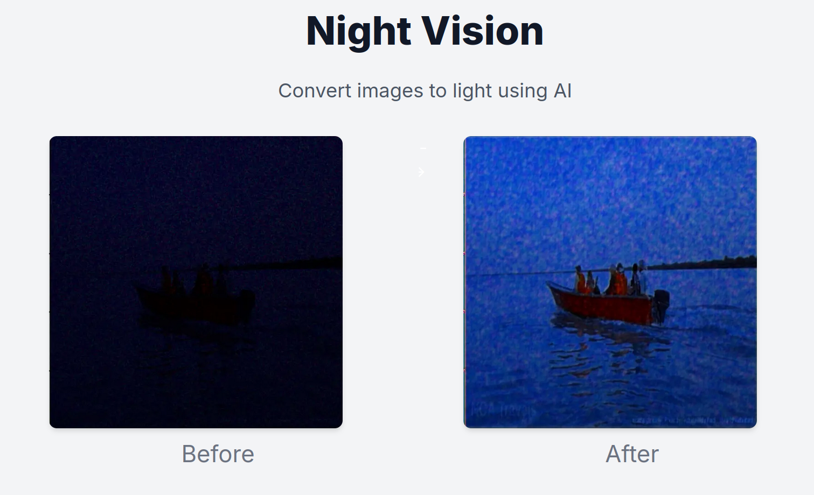
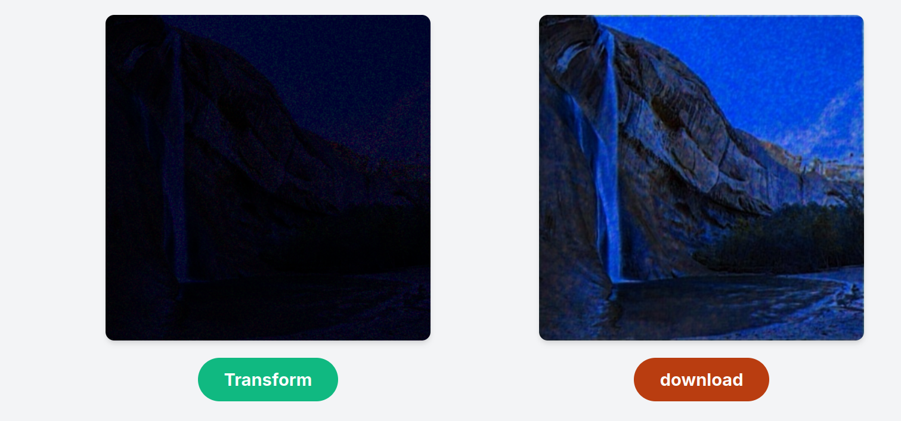

<p align="center">
  
  
</p>

<p align="center">Lighten up the night images💥🧨</p>

## Getting Started

First, install the dependencies:

```bash
npm install
# or
yarn
# or
pnpm install 
```

Then, run the development server:

```bash
npm run dev
# or
yarn dev
# or
pnpm dev
```

Open [http://localhost:3000](http://localhost:3000) with your browser to see the result.

The Flask server will be running on [http://127.0.0.1:5328](http://127.0.0.1:5328) – feel free to change the port in `package.json` (you'll also need to update it in `next.config.js`).
